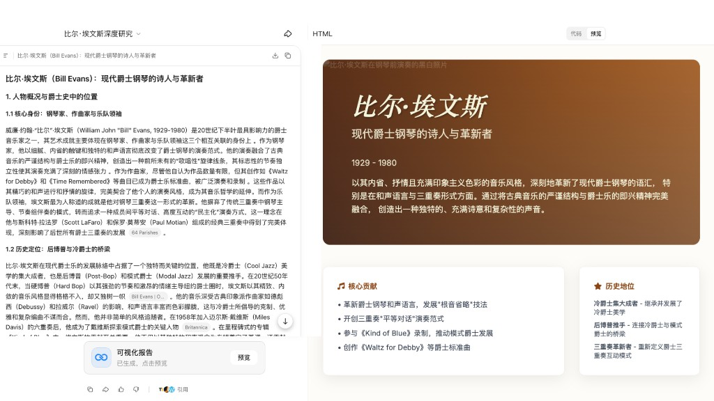
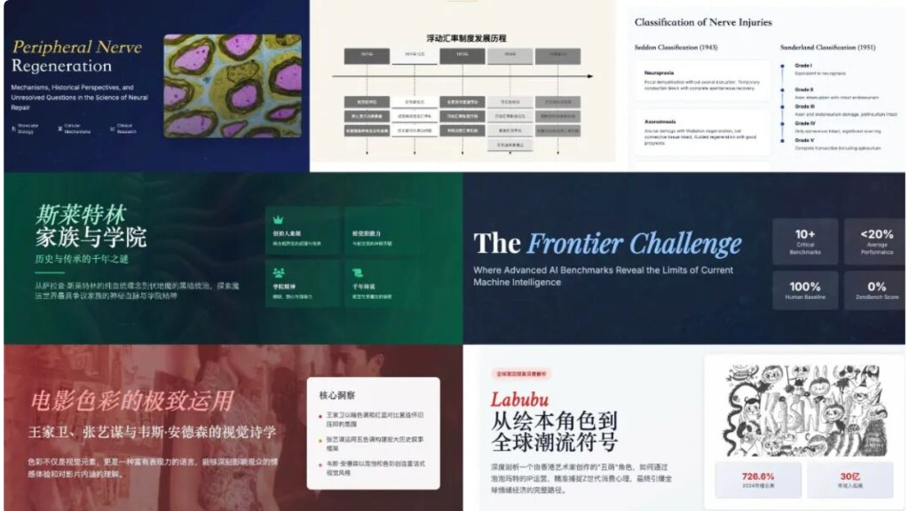
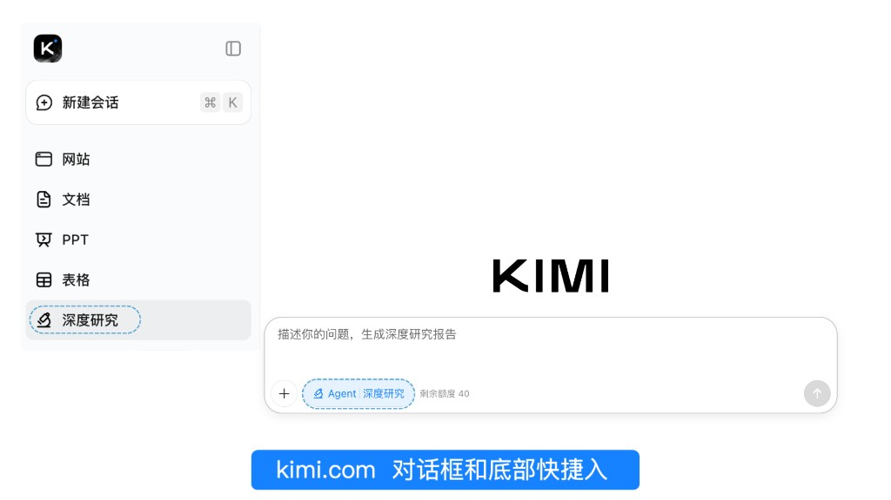
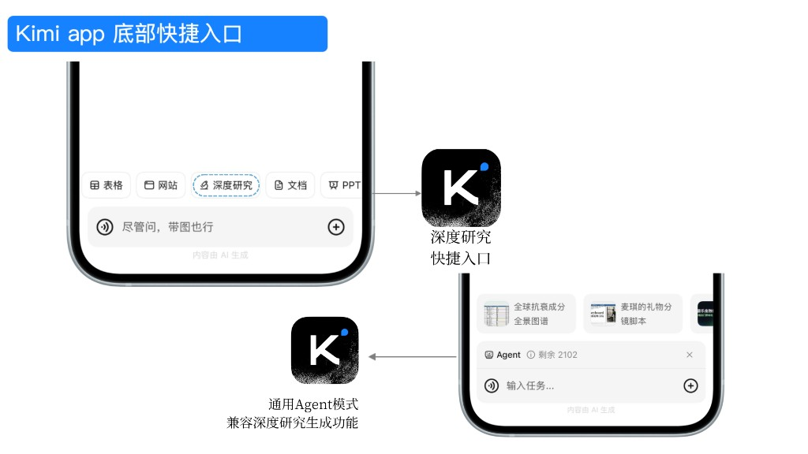
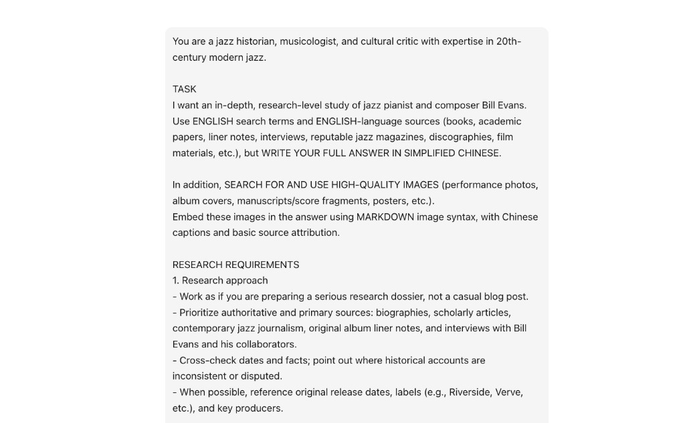
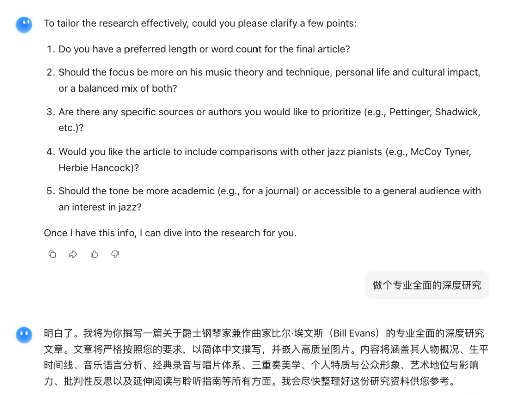

<SeoMeta
  title="Kimi 深度研究是什么？产品介绍与使用方法 - Kimi 帮助中心"
  description="了解 Kimi 深度研究功能的工作方式与适用场景。AI 自动进行多轮搜索、信息整合与分析，生成结构化研究报告，适用于行业调研、竞品分析、学术研究等场景。"
  pageUrl="https://www.kimi.com/help/deep-research/deep-research-overview"
/>

# Kimi 深度研究介绍

## 什么是深度研究？

深度研究（Deep Research）是 Kimi 最早推出的 Agent 产品之一，由 Moonshot AI 自研的 Kimi-Researcher 模型驱动。
Kimi-Researcher 基于端到端自主强化学习技术（End-to-End Agentic RL）训练而成，是专为复杂研究任务打造的新一代 Agent 模型——它不只是回答问题，而是像真正的研究员一样，自主完成从任务规划到报告交付的全流程。

## 工作链路

每接到一个问题，Kimi-Researcher 都会独立完成完整的研究链路：
- 澄清问题（Clarification）：理解问题时主动反问，构建更清晰的问题空间；
- 深入思考：每个任务平均进行 23 步推理，自主梳理并解决需求；
- 主动搜索：每个任务，平均规划 74 个关键词，找到 206 个网址，由模型判断并筛选出信息质量最高的前 3.2% 内容，剔除冗余、低质信息；
- 迭代推理：根据中间结果判断是否需要补充检索，动态调整研究路径；
- 调用工具：自主调用浏览器、代码等工具，处理原始数据并生成分析结论；
- 报告生成：将所有信息整合，输出结构化长篇报告，并附带引用来源

为了保证输出的质量和信息覆盖度，Kimi-Researcher 采用异步执行方式，用更多时间逐步推理、检索和撰写内容。毕竟，一份真正有价值的研究成果，原本需要人类耗费数天才能完成。

## 最终交付物

每次研究任务完成后，你将收到两份交付成果：

1. 一份信息详实、可溯源的深度研究报告
- 报告的平均长度在万字以上；
- 平均引用约 26 个高质量、可溯源的信源；
- 所有引用都内嵌在正文中，点击即可跳转，并高亮原文，便于验证与追溯。
//Frames

//

2. 一个可交互、可分享的动态可视化报告
//Frames

//
- 结构化排版、思维导图，让趋势、异常等重要信息一眼可见；
- 无需阅读全文，也能迅速把握整体结构与核心结论；
- 支持在线生成链接并分享，方便展示。

## 适用场景
//Frames

//
- 专业研究：投资分析、行业研究、学术课题、战略规划、财务分析等专业调研需求
- 信息整合：法律法规梳理、复杂资料检索、多源信息汇总
- 知识教育：教学内容准备、前沿领域系统梳理、深度主题探索
- 日常探索：满足好奇心，了解感兴趣的话题与世界运行规律

**不适用场景：**
- 创意写作：网文创作、剧本写作、歌词创作等
- 娱乐问题：八字排盘、运势推演、取名字、预测彩票号码等
- 固定模板：写简历、填写固定格式的表单模板、生成可编辑的 PPT

## 如何使用

### 产品入口
//Frames

//

深度研究（Deep Research）产品入口
- 网页版：[https://www.kimi.com/deep-research](https://www.kimi.com/deep-research)
- 手机/平板：打开 Kimi App → 工具栏（Taskbar）→ 切换至深度研究 Agent 模式

### 操作步骤
//Frames

//
1. 输入研究问题并发送；
//Frames

//
2. 根据 Kimi 返回的澄清问题，确认或细化研究方向，也可点击「做个全面的研究」（Include everything）跳过；
3. 系统进入自动执行阶段，可实时查看检索关键词、推理过程及访问网址；
//Frames

//
4. 研究完成后，获取深度报告与可视化报告两份成果：
//Frames

//
  - 深度研究报告（Markdown格式）：带有目录结构、多章节、结构化排版、可溯源的万字报告；
  - 可视化报告（HTML格式）：可交互、可公开分享的可视化报告
5. 按需预览、下载或分享：报告支持导出为 PDF、Word 格式；可视化报告支持预览、源代码复制及公开链接分享。
  - 预览：点击「预览」，支持切换网页版、手机版两种视图预览；
  - HTML源代码复制：点击预览，切换为「代码模式」，支持复制粘贴可视化报告源代码；
  - 点击分享：支持获取公开分享链接；

## 使用建议

1. 在提交问题前：聚焦问题范围
Kimi-Researcher 的研究质量，很大程度上取决于问题本身的清晰度。建议在提交前明确以下维度：
- 时间范围：限定信息的时间窗口，避免过时内容混入，例如“2023年至今”；
- 地域范围：指定国内、海外或特定市场，例如“仅限中国大陆市场”；
- 来源类型：指定优先参考的信息类型，例如“优先引用官方报告与学术论文”；特定领域可进一步限定，如医学领域限定 PubMed，AI 领域指定优先检索 arXiv 或 Papers With Code 上的论文与评测结果。
- 问题拆解：对于范围过大的复杂问题，建议拆分为多个子问题，分次研究，而非一次性提交，这样每次的研究深度和准确度都会更高。

2. 在澄清问题环节：主动校准研究方向
提交问题后，Kimi 会返回一次澄清确认。这个环节是影响研究质量的关键节点，建议充分利用：
- 明确指出不希望涵盖的方向，帮助模型排除干扰；
- 补充需要重点关注的具体维度或角度；
- 如果问题较复杂，可在此补充背景信息或使用场景，帮助模型更准确地理解研究意图。
请注意：若在此环节输入内容过长、表意混乱，或偏离原始问题，可能导致研究方向跑偏，建议保持回复简洁、指向明确。

3. 研究执行阶段：耐心等待，避免主动终止

## 注意事项

1. 执行时长：深度研究通常需要 10–25 分钟。执行期间可离开页面，任务将在后台异步运行，完成后将发送通知。若页面显示异常，请刷新页面，切勿点击「停止输出」。
2. 额度说明：深度研究使用 Kimi 统一额度，一次深度研究约消耗 5–10% 月度额度（以 Moderato 套餐为参考）。额度查看方式：
   - **网页版**：我的 → 设置 → 订阅，可查看当前额度余额、下次刷新时间和最近使用明细
   - **App 端**：我的 → 会员计划 → 订阅
3. 额度返还：因工具调用失败等原因导致任务失败时，额度将自动返还。
4. 输入质量：问题描述过长或表意不清，可能导致研究方向偏差，建议输入简洁、明确的研究问题。
5. 适用边界：对于简单问答需求，推荐使用普通会话模式，以获得更快速的响应。
6. 用户协议：深度研究功能须遵守[《Kimi 用户服务协议》](https://www.kimi.com/user/agreement/modelUse?version=v2)第四条相关规定。如果输入内容违反用户使用规范，Kimi 将暂停或停止向你提供服务，单次深度研究的额度会返还。

## 相关介绍

1. 技术报告：[Kimi-Researcher: End-to-End RL Training for Emerging Agentic Capabilities](https://moonshotai.github.io/Kimi-Researcher/)
2. 公众号官宣：[《模型即 Agent，Kimi-Researcher（深度研究）开启内测》](https://mp.weixin.qq.com/s/YV4M8YNZ5hnzfxaFQ7PL9A)
3. 用户案例：[深度研究案例展示](https://www.kimi.com/deep-research?showGallery=true)
