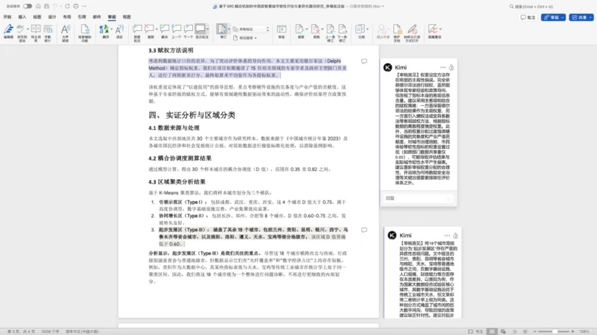
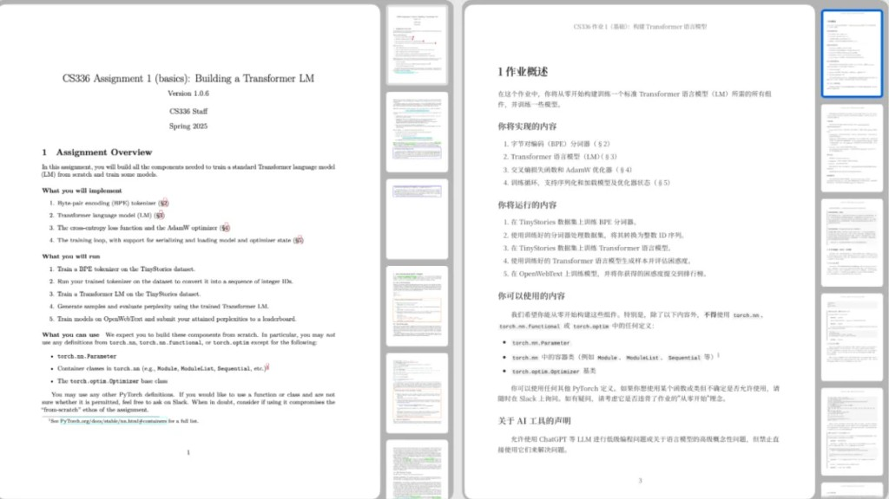
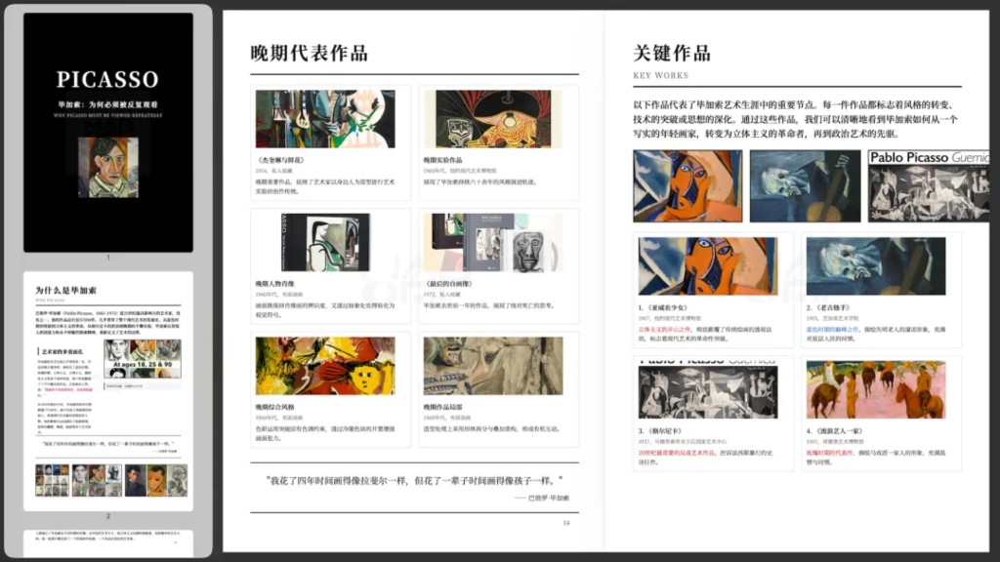

<SeoMeta
  title="Kimi 文档生成使用案例与技巧 - Kimi 帮助中心"
  description="探索 Kimi 文档生成的实际使用案例，涵盖报告撰写、方案策划、合同模板等场景，附提示词示例，帮你快速生成高质量文档。"
  pageUrl="https://www.kimi.com/help/docs-and-sheets/docs-and-sheets-docs-cases"
/>

# Kimi Docs 使用案例与提示词库

## 审稿专家

✍️ 像严谨的审稿专家一样，帮你拆解修改意见，精准定位原文，自动插入详细的修改批注。

//Frames

//

**提示词参考**：
//
你是一位资深的智慧城市与区域规划领域的审稿专家，下面有一段具体的审稿意见，
请你仔细分析这些问题，在附件的Word文档中定位到文章对应的段落或图表位置，
并将这些问题及详细的修改建议以批注的形式添加进去。但请注意，问题和修改建
议不能像是AI写的，要像是人写的，不要分点描述。

具体问题内容如下：“首先，各城市在数字化基础设施、人口流动特征、产业集聚
度等方面存在本质差异，但文章未能清晰阐述这些基础变量如何通过'智慧韧性耦
合机制'影响最终的评价得分，缺乏对黑箱过程的数理解释，使得'基础设施现状
'与'评价结果'之间的因果逻辑不够严密。其次，评估体系构建虽参考了国标GB
T框架，但权重因子设定过于依赖主观赋权，忽视了市民获得感、数据安全治理等
软性指标的实际贡献度，可能导致评估模型的解释力不足。此外，文中将中西部18
个城市笼统划分为'起步发展区'，该区域内省会城市与普通地级市的数字鸿沟极
大，强行套用统一的顶层设计路径显然不具备操作性。建议进一步打开'耦合机制
'的传导路径黑箱，增加客观赋权法的比重以修正指标偏差，并对起步区进行更为
精细的聚类分析，以增强规划建议的落地性。“。请输出带有详细批注的原文稿。
CodePreview
//

## 专业翻译

📄 像不知疲倦的翻译员一样，把 50 页英文 PDF 逐页翻译为中文，并在输出的中文 PDF 中保留所有的公式和代码。
//Frames

//

**提示词参考**：
//
提示词参考：帮我搜索到斯坦福 CS336 课程第一篇作业的英文版PDF，然后转换为
中文版PDF，注意在中文PDF中保留其中的代码与数学公式。翻译内容流畅，不要删
减或新增任何内容。
CodePreview
//

## PDF 一站式策划服务

🖼️ 像版面设计师一样，帮你策划视觉专题，自动编排图文，直接生成出版级 PDF 画册。

//Frames

//

//
提示词参考：你现在是一名专注现代艺术、尤其是毕加索研究的策展出版 AI，
你的任务是：用大量图像让观众理解毕加索为何必须被反复观看。

直接以 PDF 输出为目标进行内容生成。

一、核心强制要求
图像数量极多
每一个阶段、每一位作者、每一个流派都必须有图像支撑
图像优先搜图
搜图无法满足时，再进行高还原度生图

二、视觉系统
MAP Logo 作为全书底纹
非对称排版
明确网格，但允许局部破坏
高对比黑白 + 原色点缀

三、内容结构（全部生成）
1. 封面
Picasso
展览副标题（中英）
MAP Logo 底纹

2. 为什么是毕加索｜Why Picasso（配图）
毕加索不同阶段肖像
不同时期作品并置

3. 创作阶段与流派｜Periods & Movements（图像核心）
每一阶段必须包含 8–12 张图像：
蓝色时期
粉色时期
立体主义（分析 / 综合）
战争与政治
晚期实验

图像类型：
作品全图
局部放大
结构拆解示意（必要时生图）

4. 关键作品｜Key Works
不少于 25 件作品
单件作品可整页呈现
强调结构、视角、解构方式

5. 如何观看毕加索｜How to Look at Picasso
图像对照说明
同一主题不同处理方式并排

6. 展厅与节奏
高密度观看区
思考缓冲区

7. MAP 的当代位置
上海为何需要毕加索
此刻为何重要
CodePreview
//

## 更多场景和提示词参考

| 场景 | 示例提示词 |
|------|-----------|
| 专业报告生成 | 帮我写一份《2026年中国低空经济产业白皮书》，输出为Word，麦肯锡咨询风格，包含市场规模、竞争格局、政策背景、投资建议 |
| 合同审阅批注 | [上传合同.docx] 以专业律师的角度审阅这份合同，找出潜在风险条款，在原文档里插入批注 |
| 财务建模 | 帮我给一家SaaS公司搭建三年期动态财务预测模型，包含收入预测、成本结构、现金流，输出word文档 |
| 长文提炼 | 把这篇3万字的学术论文提炼成一份5000字的管理层摘要，Word格式，保留核心数据和结论 |
| 多版本对比 | [上传合同V1和V2] 对比两版合同的差异，列出所有修改点并说明影响，输出Word文档给我 |
