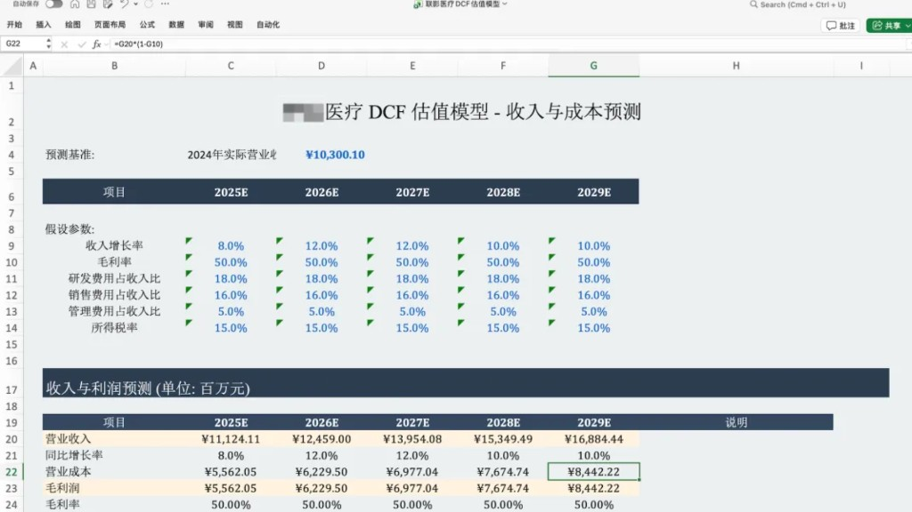
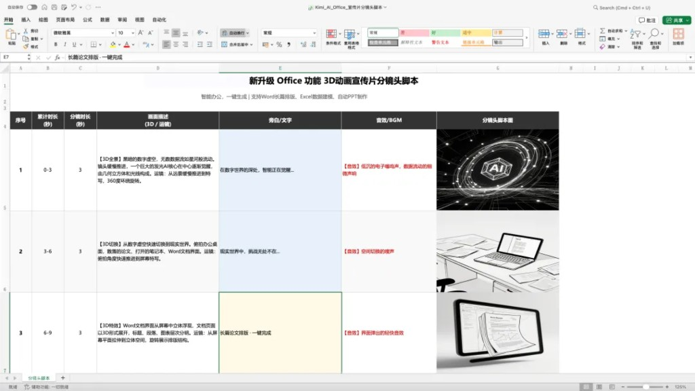

<SeoMeta
  title="Kimi 表格生成使用案例与技巧 - Kimi 帮助中心"
  description="探索 Kimi 表格生成的实际使用案例，涵盖数据整理、财务分析、项目排期等场景，了解如何用自然语言快速创建专业表格。"
  pageUrl="https://www.kimi.com/help/docs-and-sheets/docs-and-sheets-sheets-cases"
/>
# Kimi Sheets 使用案例

## 财务估值

📊 像金融分析师一样，帮你搜集真实财务数据，搭建 DCF 估值模型，对企业进行模拟估值。

//Frames

//

**提示词参考**：
//
提示词参考：用 DCF 法对XX医疗进行估值。将全部估值流程和数据放入excel表格
中，并给出数据出处，对于市场规模、增长率、市场份额等需要估计的数字给出估
计的逻辑，对于大环境背景也融入分析中。
CodePreview
//

## 分镜创作

🎥 像分镜师一样帮你制作 Excel 格式的视频分镜脚本，包括时长、画面描述、旁白、音效和分镜头参考图。

//Frames

//

**提示词参考**：
//
提示词参考：帮我做一个Kimi AI产品——OK Computer新升级，支持生成、编辑
Office 文档（例如用Word做长篇论文排版，用Excel做数据建模和分析，自动做PPT
）的3D动画宣传片分镜头脚本 的 excel 。

excel里要包含A列：序号（1-20）。

B列：累计时长（秒）。

C列：分镜时长（秒）。

D列：画面描述（3D / 运镜）。

E列：旁白/文字（使用不同背景色区分旁白和屏幕文字）。

F列：音效/BGM (使用不同字体颜色区分)。

G列：分镜头脚本图（每一个画面分镜都需要生图且必须保持一致性 用分镜师最常用
的黑白线绘草稿风格）

请自行设计创意大纲、脚本、分镜并最终生图完成这个脚本，以一个美观的excel呈
现
CodePreview
//

## 更多场景和提示词参考

| 场景 | 示例提示词 |
|------|-----------|
| 财务建模 | 用DCF法对XX公司进行估值，全部流程和数据放入Excel，标注数据来源，给出增长率等关键假设的估计逻辑 |
| 行业数据对比 | 调研国内新能源车企前20名，列出市值、2025年销量、主力车型、近期新闻，输出对比表格 |
| 文献整理入表 | 检索近三个月关于大模型推理优化的论文，整理到Excel，包含标题、作者、核心方法、创新点 |
| 多表合并 | [上传12个月销售Excel] 把这12张表合并成年度汇总，计算各月环比增长率，用函数做多表联动 |
| 销售线索提取 | [上传展会PDF/图片] 提取所有参展商信息，整理成1000行销售线索Excel，包含公司名、联系方式、产品类别 |
| 项目管理表 | 帮我做一个PMO项目管理Excel，包含任务列表、负责人、进度状态、甘特图，多表联动 |
| 数据可视化 | 把这份销售数据Excel做成可视化仪表板，包含趋势折线图、地区分布图、完成率环形图 |
