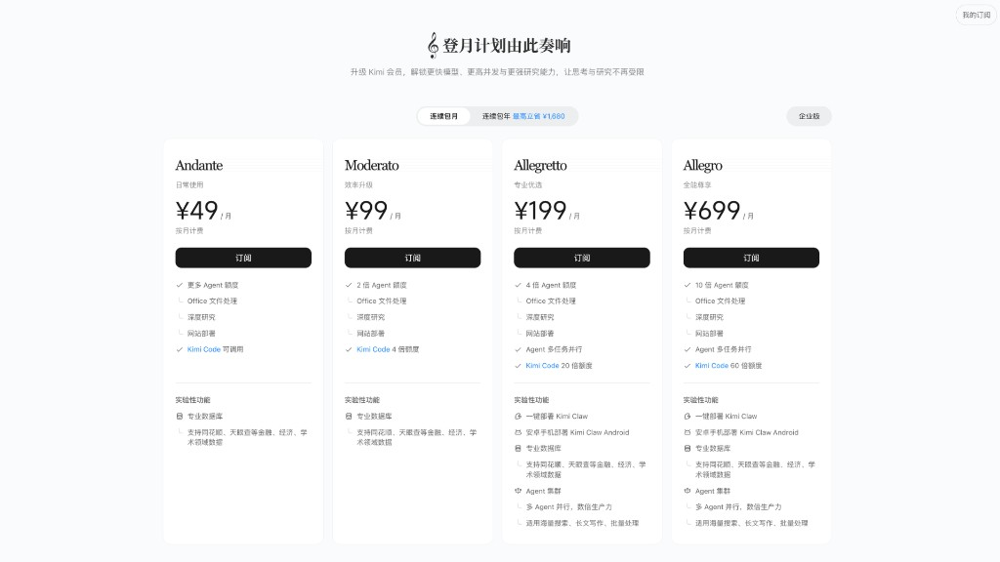
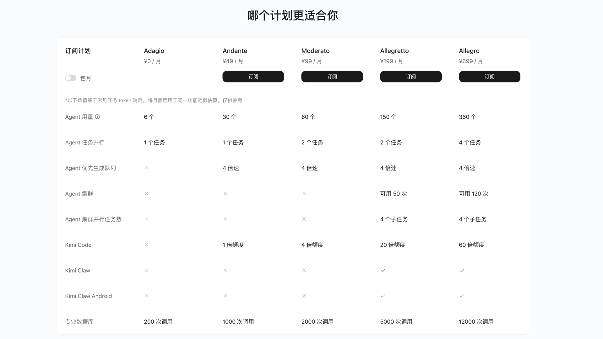

<SeoMeta
  title="Kimi 会员体系介绍 - Kimi 帮助中心"
  description="全面了解 Kimi 会员体系，包括五档套餐定位、权益范围、额度机制和订阅方式，找到最适合你的会员方案。"
  pageUrl="https://www.kimi.com/help/membership/membership-overview"
/>

# 会员订阅服务权益介绍

Kimi 提供四档会员订阅套餐，满足从个人日常到专业重度使用的不同需求。所有套餐均采用统一额度池，额度可跨功能共享。

## 套餐对比

//Frames

//

|  | Andante ¥49/月 | Moderato ¥99/月 | Allegretto ¥199/月 | Allegro ¥699/月 |
| --- | --- | --- | --- | --- |
| 定位 | 日常使用 | 效率升级 | 专业优选 | 全能尊享 |
| Agent 额度 | 更多 Agent 额度 | 2 倍 Agent 额度 | 4 倍 Agent 额度 | 10 倍 Agent 额度 |
| Office 文件处理 | ✅ | ✅ | ✅ | ✅ |
| 深度研究 | ✅ | ✅ | ✅ | ✅ |
| 网站部署 | ✅ | ✅ | ✅ | ✅ |
| Agent 多任务并行 | — | — | ✅ | ✅ |
| Kimi Code | 可调用 | 4 倍额度 | 20 倍额度 | 60 倍额度 |

> **Agent 用量说明**：Agent 额度可用于 Office 文件处理、深度研究、网站部署等 Agent 功能。

### 探索性功能

|  | Andante ¥49/月 | Moderato ¥99/月 | Allegretto ¥199/月 | Allegro ¥699/月 |
| --- | --- | --- | --- | --- |
| 一键部署 Kimi Claw | — | — | ✅ | ✅ |
| 安卓手机部署 Kimi Claw Android | — | — | ✅ | ✅ |
| 专业数据库 | ✅  | ✅ | ✅ | ✅ |
| Agent 集群 | — | — | ✅ | ✅ |

//Callout 提示
- **专业数据库**：支持同花顺、天眼查等金融、经济、学术领域数据源。
- **Agent 集群**：多 Agent 并行、数据生产力，适用海量搜索、长文写作、批量处理。
//

## 哪个计划更适合你

//Frames

//

> 以下数值基于常见任务 token 消耗，将月额度用于同一功能的估算，仅供参考。

|  | Adagio ¥0/月 | Andante ¥49/月 | Moderato ¥99/月 | Allegretto ¥199/月 | Allegro ¥699/月 |
| --- | --- | --- | --- | --- | --- |
| Agent 用量 | 6 个 | 30 个 | 60 个 | 150 个 | 360 个 |
| Agent 任务并行 | 1 个任务 | 1 个任务 | 2 个任务 | 2 个任务 | 4 个任务 |
| Agent 优先生成队列 | — | 4 倍速 | 4 倍速 | 4 倍速 | 4 倍速 |
| Agent 集群 | — | — | — | 可用 50 次 | 可用 120 次 |
| Agent 集群并行任务数 | — | — | — | 4 个子任务 | 4 个子任务 |
| Kimi Code | — | 1 倍额度 | 4 倍额度 | 20 倍额度 | 60 倍额度 |
| Kimi Claw | — | — | — | ✅ | ✅ |
| Kimi Claw Android | — | — | — | ✅ | ✅ |
| 专业数据库 | 200 次调用 | 1000 次调用 | 2000 次调用 | 5000 次调用 | 12000 次调用 |

> **Agent 用量说明**：Agent 额度可用于 Office 文件处理、深度研究、网站部署等 Agent 功能。

### 使用场景与推荐

- **轻度体验**：免费的 Adagio 即可满足基本问答需求。
- **日常使用**：偶尔写文档、做 PPT，推荐 **Andante**（¥49/月）。
- **效率升级**：频繁编程（详见 [Kimi Code](https://www.kimi.com/code)）、需要专业数据库辅助工作，推荐 **Moderato**（¥99/月）。
- **专业优选**：需要部署 Kimi Claw 专属助理、使用 Agent 集群批量处理任务，推荐 **Allegretto**（¥199/月）。
- **全能尊享**：重度使用所有功能、追求最大额度与最高效率，推荐 **Allegro**（¥699/月）。

## 计费方式

- **统一额度池**：所有功能共享同一额度池，按实际 token 消耗计算。
- **按月刷新**：额度在每个计费周期自动刷新。
- **频次限制** 5小时及周频控请以页面提示为准。
- **使用优先级**：系统优先消耗获赠额度，再消耗套餐额度。

//Callout 信息
**什么是 Token？**

Token 是大语言模型处理文本的最小单位。中文里，1 个汉字通常约等于 1–2 个 token；英文里，1 个单词通常约等于 1–1.5 个 token。你输入的内容和 Kimi 输出的内容都会消耗 token。

**如何估算一个任务的 Token 消耗？**

- 一次普通对话（几百字问答）：约几百到一千 token
- 生成一份简单的 PPT：约消耗 1–2% 月度额度
- 一次深度研究：约消耗 5–10% 月度额度
- 编写一段代码：约消耗 0.5–2% 月度额度

任务越复杂、上下文越长，消耗的 token 越多。你可以在「设置 → 订阅」页面随时查看剩余额度。
//

## 包年优惠

选择连续包年订阅，最高可立省 **¥1,680**，适合长期使用的用户。

## 常见问题

### 为什么我的权益使用和之前不一样了？

我们进行了权益升级，已经为您打通了权益额度。现在，Agent、PPT、Kimi Code 等功能额度统一共享，按实际使用量计费。具体可参考[会员额度说明](https://www.kimi.com/membership-credits)。

### 如何开具发票？

访问 [kimi.com](https://www.kimi.com)，点击左下角头像 → 设置 → 订阅 → 账单 → 开发票。

- **修改收件邮箱**：进入订阅界面，点击对应订单的「已开票」按钮，更新邮箱后点击「重新发送」即可。
- **发票信息有误**：请发送邮件至 membership@moonshot.cn，附上原始发票及正确的开票信息，我们会尽快为您重新开具。

### 如何升级会员计划？

访问 [kimi.com](https://www.kimi.com)，点击左下角头像 → 会员计划，选择您心仪的新计划，完成支付即可。

//Callout 提示
升级时，我们会根据您当前会员的剩余天数折算退款。新会员权益从升级当天立即生效，无需等待。
//

### 会员权益有效期是多久？

包月和包年的会员权益均以月为周期发放，会员权益有效期为自订阅生效之日起 30 天。

//Callout 注意
订阅期内未使用的权益将在到期后自动清零，请及时使用。
//

### 如何查看额度使用情况？

- **Web 端**：点击左下角头像 → 设置 → 订阅
- **APP 端**：我的 → 会员计划 → 订阅

可查看当前额度余额（百分比）、下次刷新时间，以及最近 10 条使用明细（使用时间、功能、消耗比例）。

//Callout 提示
使用明细数据可能存在短暂延迟，请以当前额度显示为准。
//

### 额度用完了怎么办？

当前正在进行的任务可以正常完成，新任务将提示额度不足。您可以：

- 等待额度自动刷新（5 小时 / 周度 / 月度刷新，以页面提示为准）
- 升级至更高等级会员获取更多额度
- 参与官方活动获取赠送额度

### 获赠额度会过期吗？

会。获赠额度（如试用赠送、活动奖励）通常有有效期（如 7 天、30 天），过期后将自动失效。系统优先消耗获赠额度，再消耗套餐额度。

### 可以把额度都用在一个功能上吗？

可以。统一额度池的核心就是让您自由支配，可以把所有额度集中用在最常用的功能上（Agent、PPT、深度研究、Kimi Code 等均共享同一额度）。

### 付费服务可以退费吗？

付费服务属于虚拟服务，一经成功购买并开通后即视为成功消费，除法律法规另有规定外，不可退费或转让。请在购买前务必核对服务及权益信息、价格、使用期限。

### 未成年人消费提醒

未满 18 周岁的未成年人应在监护人指导下阅读相关协议，经监护人同意后方可购买付费服务。监护人应妥善保管账号、设备及密码，避免未成年人未经同意进行付费操作。

## 更多会员相关问题

- [会员是怎么收费的/套餐包括什么？](pricing.md)
- [会员权益到账与查询](account-query.md)
- [会员额度更新与使用规则](update-rules.md)
- [套餐升级与降级](upgrade-downgrade.md)
- [取消自动续费](cancel-subscription.md)
- [支付相关问题](payment-issues.md)
- [用户如何自助开发票](invoice.md)
- [Andante 七天试用权益介绍](trial.md)
- [会员问题联系方式](contact.md)
