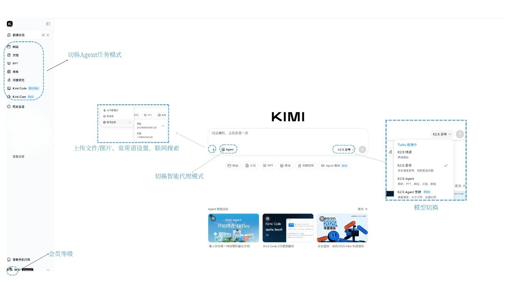
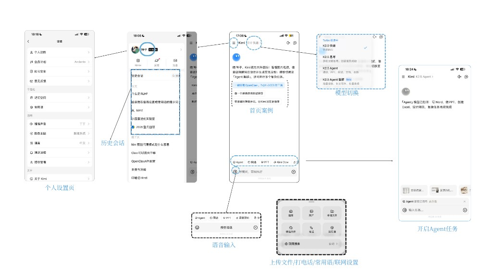

<SeoMeta
  title="Kimi 新手入门指南 - Kimi 帮助中心"
  description="从零开始使用 Kimi：了解产品核心功能、注册登录方法、对话技巧和常用功能入口，快速上手 AI 智能助手。"
  pageUrl="https://www.kimi.com/help/new-user-guide/overview"
/>

# Kimi 概述

Kimi 是由 Moonshot 自主研发的 AI 智能助手，支持联网搜索、深度思考、多模态推理和超长文本对话。

访问 [Kimi.com](https://www.kimi.com/) 或下载 Kimi App，即可开始聊天、创作、研究和构建应用。开发者可前往 [Kimi 开放平台](https://platform.kimi.ai/) 获取 API 与工具，将 Kimi 能力集成到自己的应用中。

## 会话模式

- **联网搜索**：连接网络获取实时信息，支持搜索网络信息。
- **快速模式**：快速回答相关信息。
- **思考模式**：支持更深入的多轮思考与搜索——非常适合编码、逻辑或分析任务。

//
**提示**：对于简单的基于文档的问答，可将联网模式、思考模式都关闭。
Callout 提示
//

## Agent 智能代理

Kimi 不仅是对话助手，更是能自主执行任务的 AI Agent：

- **[通用 Agent](https://www.kimi.com/agent)**：自动规划并完成任务，支持网站生成、PPT 制作、深度研究、文档和表格处理等。
- **[Agent 集群](https://www.kimi.com/agent-swarm)**：支持高达 1500 次并行工具调用，可以自主调度多达 100+ 子智能体（Sub-agents）并行处理任务，适用海量搜索、长文写作、批量处理任务。
- **[Kimi Code](https://www.kimi.com/code?from=kfc_overview_topbar)**：面向开发者的编程助手套件，包括命令行工具（CLI）、VS Code 插件。
- **[Kimi Claw](https://www.kimi.com/bot)**：零部署云端自动化平台，无需服务器或 Docker，30 秒内即可启动持续运行的 AI 代理。内置 5,000+ 技能库（ClawHub），支持链式组合调用与多步骤自主规划，轻松完成复杂调研与数据分析流程。

## 其他核心功能

- **特色功能**：拍照解题、语音通话、翻译、写作。
- **文件处理**：支持 PDF、Word、Excel、PPT、图片、TXT、视频（单个不超过 100M），最多支持 50 个文件。
- **常用语**：添加你常用的快速提示，适合把高质量、可复用的提示词设置为常用语。

//
[基础会话](agentic-chat) 会话是一切的起点。支持输入你的问题、上传文件或切换模型、切换Agent模式
[搜索](search) 搜索是模型的实时知识库：联网搜索用于获取即时、可信、可溯源信息
[记忆空间](memory-space) 记忆空间可以长期保存你的偏好，并在后续的对话中参考过往聊天记录
[Agent智能代理](agent-overview) 自主执行任务，只需要你说出目标，建站、文档、数据分析、PPT都可以
ColumnsContent
//

## 界面介绍

### 网页版

//Frames

//

- **[网页版](https://www.kimi.com/)**：直接在浏览器中使用 Kimi，无需下载安装。

### 手机/平板

//Frames

//
