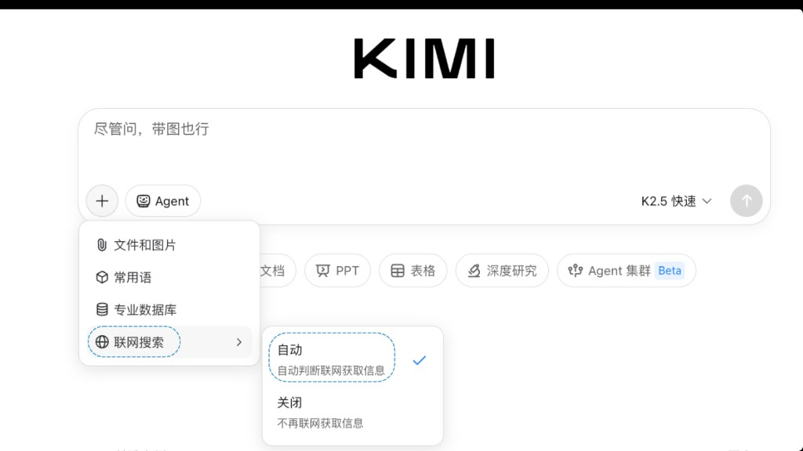
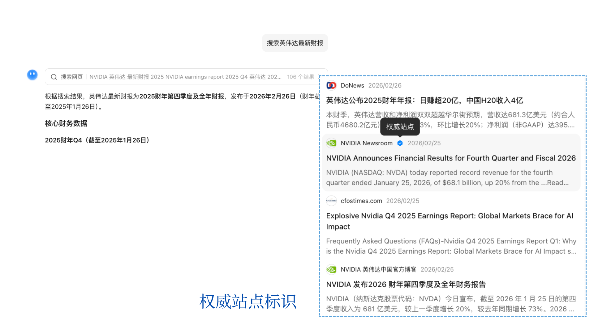
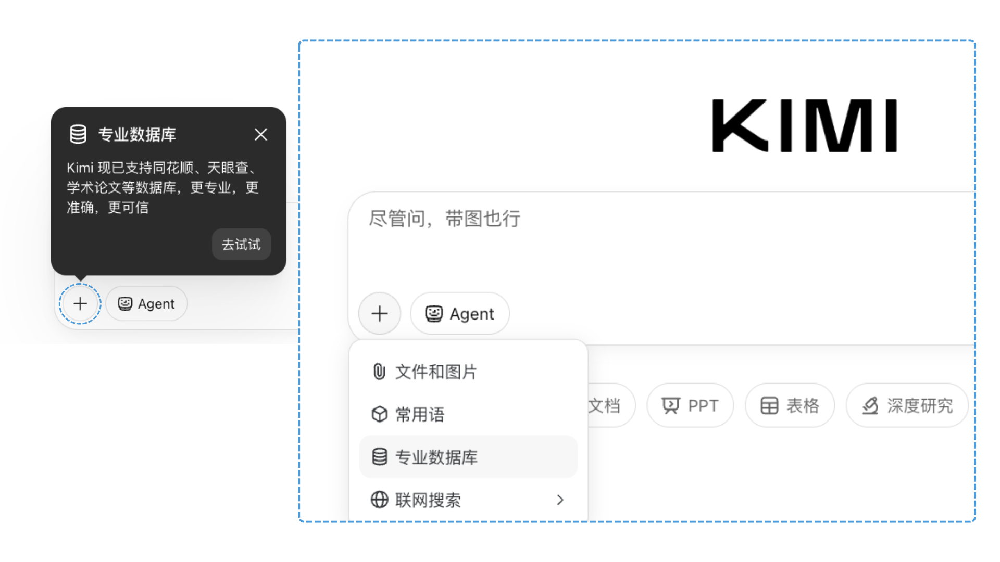
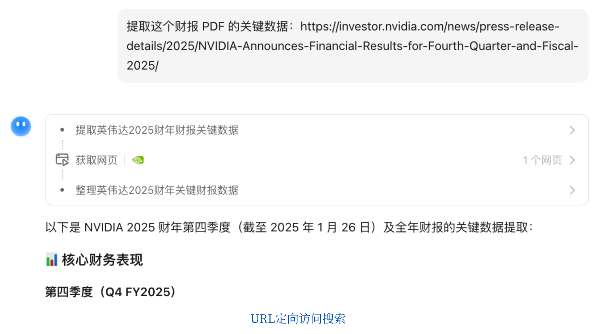

<SeoMeta
  title="Kimi 搜索功能使用指南 - Kimi 帮助中心"
  description="了解 Kimi 的联网搜索能力，AI 自动检索最新信息并整合分析，为你提供有据可查的回答，告别信息过时的困扰。"
  pageUrl="https://www.kimi.com/help/new-user-guide/search"
/>

# Kimi Agentic 搜索介绍

Kimi 的 Agentic 搜索采用端到端自主强化学习（End-to-end Agentic RL）架构，区别于传统的工具编排方案，让 AI 自主决定何时搜索、调用何种工具、如何修正策略，从而完成复杂的信息搜集与处理任务。
相比传统搜索的关键词匹配，Kimi 的搜索能力经历了两次核心进化：
- 探索版搜索（2024年10月）实现了大模型语义理解 + 实时信息检索，可自动拆解复杂问题、溯源信源；
- Agentic 搜索则进一步实现了自主规划与工具调用，支持金融数据查询、学术文献检索、图片搜索等多模态任务。

## 搜索联网设置

//Frames

//

联网搜索用于突破知识时效边界，获取即时、可信、可溯源的最新信息。
点击对话输入框下方的「联网搜索」开关（显示为🌐图标）。开启后，Kimi 将自主判断当前问题是否需要实时数据，智能调用搜索引擎与垂直数据库完成信息检索与整合。
## 核心能力

1. **即时性与权威性并重**
实时检索互联网信息，覆盖 100+ 经过验证的可信来源（主流新闻媒体、政府公告、金融数据平台、学术期刊库），确保资讯既新鲜又权威。

2. **信息溯源机制**
所有基于搜索的回答均附带参考来源链接，用户可点击查看原始网页，完整验证信息真实性与上下文。

3. **全球化信息获取**
支持中英文自然对话，可主动检索非中文资料（如指定搜索英文新闻源、日文技术文档等），自动整合多语言信息。

## 推荐使用场景

- 查询最新资讯（新闻动态、股市行情、政策变化）
- 验证存疑信息（网络传言、历史数据、统计口径）
- 专业领域调研（竞品动态、学术前沿、行业标准）

## 权威信源标识
Kimi 的联网搜索会基于相关性、权威性、时效性三重维度筛选信息源，自动过滤风险站点、同源转载、低质网络信息及模型幻觉内容，确保结果有效可信。
//Frames

//

Kimi通过严格筛选的优质信源将在回答中标注权威标识（如官网认证、学术认证、媒体认证等图标），便于你快速识别高可信度信息。
信源筛选机制
- 自动剔除：低质聚合站点、未经证实的自媒体、过期缓存页面
- 优先收录：政府机构官网、权威媒体、学术期刊、官方财报渠道

## 专业数据库
Kimi 在专业场景下支持调用垂直领域数据库，提供结构化、可溯源的专业数据。
- **全球金融数据库**：提供全球股票、期货、汇率等金融数据
- **同花顺ifind金融数据库**：中国及全球股票、期货、指数等金融数据
- **股票金融数据库**：中国及全球股票、期货、指数等金融数据
- **天眼查企业数据库**：企业工商信息、股权、司法风险等数据
- **学术数据库**：期刊、论文、预印本、学位论文、专利等学术信息
- **世界银行经济数据库**：各国 GDP、人口、就业、贸易等经济指标

### 如何使用专业数据库
点击对话输入框下方的「+」按钮，选择「专业数据库」，点击「去试用」即可跳转至数据库试用界面。
//Frames

//
开启后，你可以在对话中直接引用专业数据库进行提问，Kimi 会自动从对应数据库中检索并返回结果。

//Frames

//

示例：

> **用户**：帮我根据世界银行数据库查找 2025 年的英国人口数

> **用户**：查一下字节跳动的工商注册信息

> **用户**：搜索关于大语言模型推理优化的最新论文

### 真实案例

//
💬 **用户**：石油和黄金今天涨价了吗？
Chat 19cb02e7-6442-81b9-8000-000053dcd2dd
//

//
💬 **用户**：在天眼查查一下，戴大昌在江苏恒尚信息系统集成服务有限公司担任什么职务？
Chat 19cb02e0-a612-8443-8000-0000baef4e73
//

//
💬 **用户**：请从公开网站（企查查、爱企查）拉取【凯辉（上海）私募基金管理有限公司】的所有对外投资公司列表，包括公司名称及设立时间，以及对应公司的注册资本。
Chat 19cb02fd-4022-8d15-8000-0000b39a32af
//

//
💬 **用户**：对比全球前三大经济体GDP、人均GDP、失业率情况？
Chat 19cb21e0-8ac2-8112-8000-00002e35d986
//

## 智能搜索
### 图片搜索
Kimi 支持基于图片的搜索与理解。上传图片后，Kimi 可自动判断调用图搜工具，识别图像内容并进行相关信息检索。

**使用方式**
- 直接上传图片（支持 JPG、PNG 等格式）
- 在提问中描述图片内容或询问图片相关信息
- Kimi 将结合图像识别与网络搜索，提供图片出处、相似图片、相关信息等

**知识学习**
//
💬 **用户**：这段内容来自哪里
Chat 19d8b0d6-34f2-8f78-8000-00009a5a124c
//

**地理寻踪**
//
💬 **用户**：这张地理位置在哪里
Chat 19d8b074-7792-8184-8000-00000bf1231f
//

**梗图解读**
//
💬 **用户**：这个人遇到了什么情况，他在说什么
Chat 19d8b0aa-e182-8078-8000-0000ce5c0dee
//

**典型场景**
- 识别未知物体、地标建筑、产品型号
- 查找某张图片的来源或原始出处
- 分析图表、截图中的数据并检索相关背景

### 定向访问搜索URL
Kimi搜索支持定向访问URL（Uniform Resource Locator，互联网上用于定位和访问资源，如网页、文件、图片等资源的地址字符串）用于获取互联网资源。

//Frames

//

**典型场景**

- 内容总结：粘贴一篇长文、新闻报道或技术博客的链接，让 Kimi 快速提炼要点
- 财报分析：粘贴上市公司财报 PDF 链接，提取关键财务数据、同比变化和风险提示
- 图片与多媒体推理：粘贴包含图片、图表的页面链接，让 Kimi 识别并解读其中的视觉信息
- 竞品调研：粘贴竞品的产品页面或定价页面，让 Kimi 整理功能对比和差异点
- 论文速读：粘贴 arXiv 或学术期刊的论文链接，快速获取摘要、方法和核心结论
- 政策解读：粘贴政府公告或法规原文链接，让 Kimi 梳理关键条款和影响范围

## 操作方式
在对话中直接粘贴网址，Kimi 将自动抓取并分析该页面内容：
示例提问：
- 总结这篇文章的要点：https://example.com/article
- 提取这个财报 PDF 的关键数据：https://example.com/report.pdf
- 这个链接里的图片展示了什么信息：https://example.com/infographic

//
💬 **用户**：内容总结
Chat 19cb22be-2cc2-8024-8000-0000723f68eb
//

//
💬 **用户**：PDF阅读
Chat 19cb2283-20f2-834a-8000-0000f2d9d40b
//

//
💬 **用户**：搜索推理URL链接内容
Chat 19cb03d7-e5f2-8bc2-8000-00002cd4d277
//

## 温馨提示

- 建议优先使用**公开可访问**的链接（如新闻页面、公开的 PDF 文档）
- 部分**受密码保护**或限制爬取的网页可能无法访问
- 对于**动态加载**的网页，Kimi 可能仅能获取初始 HTML 内容
- **Kimi 的对话链接分享**，Kimi 无法二次阅读对话内容
