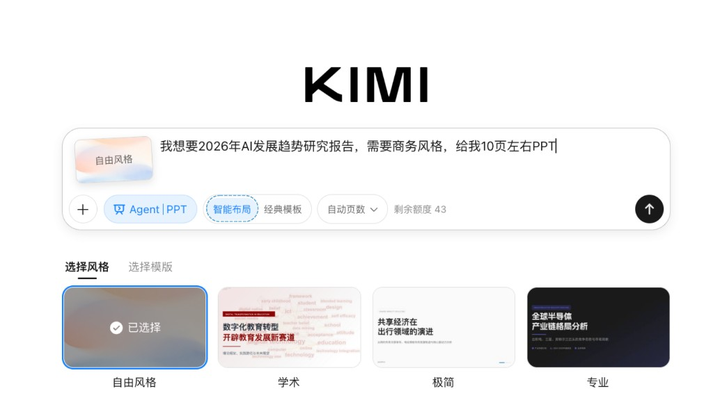
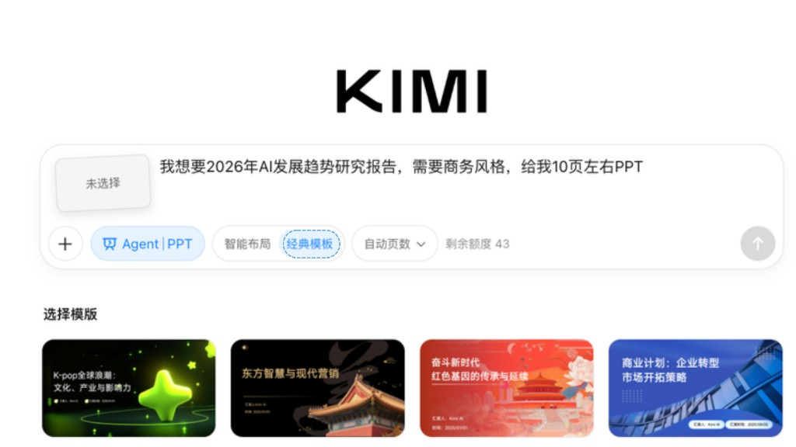
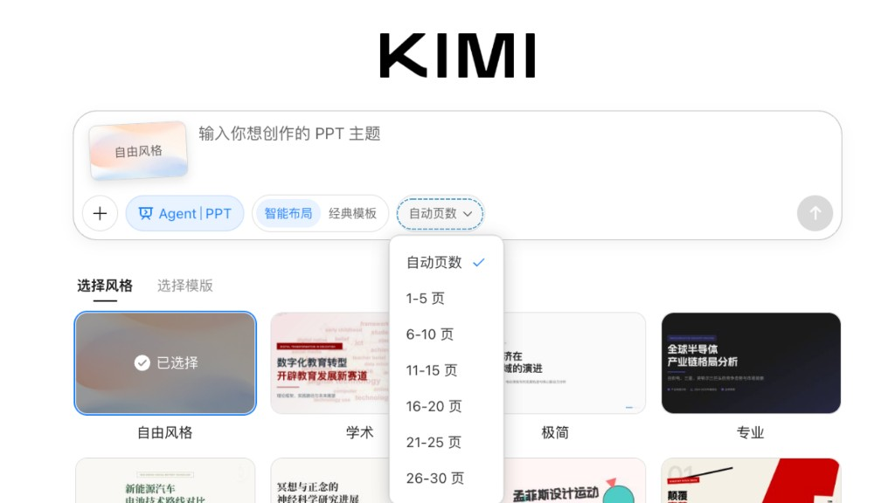
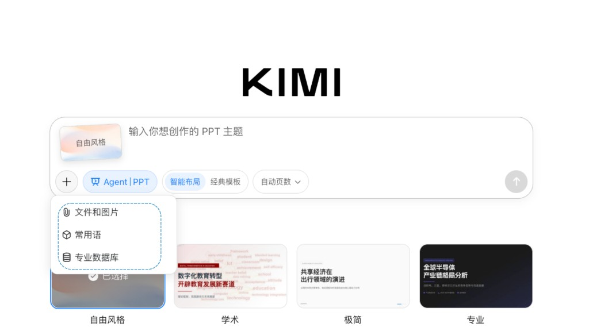
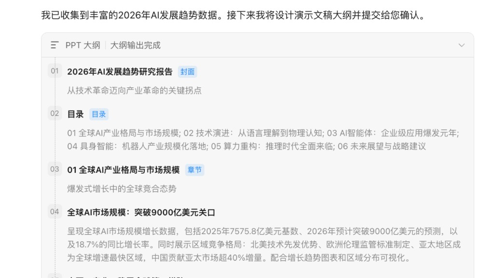
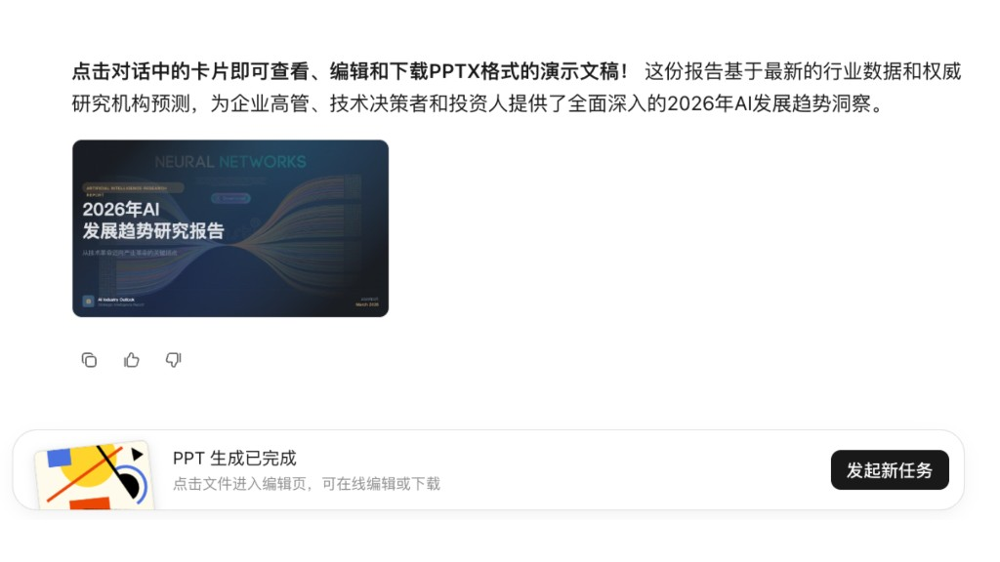
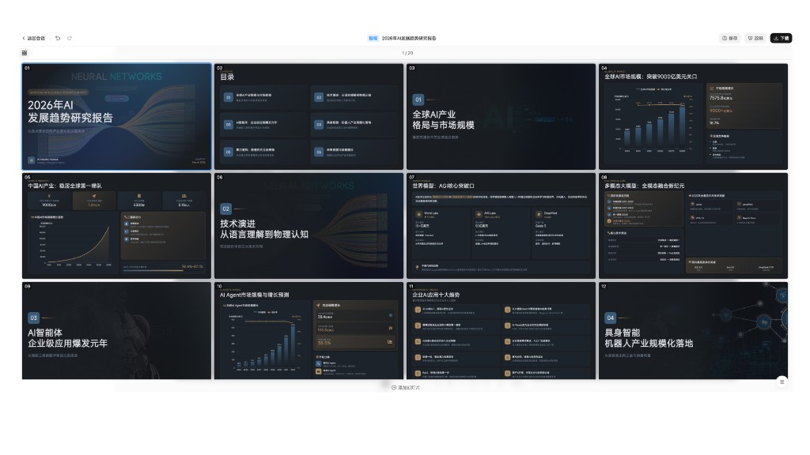
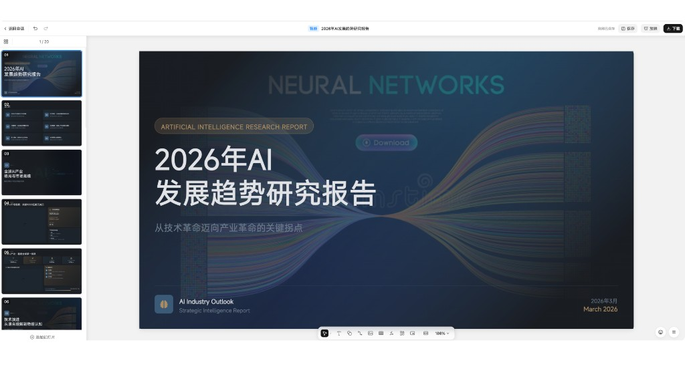
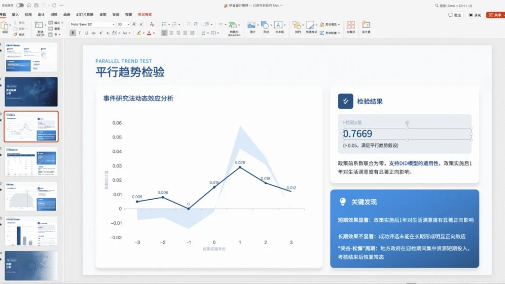

<SeoMeta
  title="Kimi PPT 智能生成功能介绍 - Kimi 帮助中心"
  description="了解 Kimi PPT 的核心能力：AI 自动调研、内容生成和智能设计，支持一键生成和多轮优化，附多场景示例提示词。"
  pageUrl="https://www.kimi.com/help/ppt/ppt-overview"
/>

# Kimi PPT 介绍

## Kimi PPT 是什么

Kimi PPT 是 Kimi 推出的智能PPT生成工具。
K2.5 支持格式转换，可将 3 万字长文一键转换为 PPT，自动优化排版与设计。 模型先对输入材料做语义理解，提炼核心论点，自动规划章节结构与逻辑顺序，再生成每页的标题、正文、配图建议。PPT工具会根据内容类型选择最合适的视觉叙事方式，数据用图表、流程用箭头、对比用并列结构。
目前PPT输入支持上传 PDF、Word、Excel、TXT、图片格式，上传材料后，Kimi 会基于内容自动生成大纲。

## 与传统 PPT 对比

| 维度 | 传统 PPT | Kimi PPT |
|------|----------|----------|
| 制作方式 | 手动排版、逐页设计 | 一句话生成完整大纲+内容+设计 |
| 耗时 | 数小时至数天 | 几分钟生成初稿 |
| 内容生成 | 需自己撰写文案 | AI 自动研究、撰写、结构化 |
| 视觉设计 | 依赖模板或设计能力 | AI 自动匹配配色、排版、图表 |
| 迭代效率 | 手动调整，效率低 | 对话式修改，实时优化 |

## Kimi PPT 的核心优势

1. AI 深度研究 + 内容生成
- 基于 Kimi 的长文本和搜索能力，可自动调研主题、整理数据、生成专业内容
- 不是“空模板”，而是带完整文案的成品
2. 一键生成，多轮优化
- 输入主题即可生成大纲 → 确认后生成完整 PPT
- 支持对话式修改：“换成商务风格”、“增加数据页”、“第三页换种表达方式”
- 在线编辑调整修改：PPT生成后，可以点击预览，并在线修改
3. 智能视觉设计
- 自动匹配主题配色、字体、图标、图表样式
- 支持多种风格切换（商务、学术、科技、简约等）
4. 与 Kimi 生态无缝衔接
- 可基于 Kimi 的搜索结果、文档分析、深度研究生成 PPT
- 支持将长文报告（word、txt、PDF等）自动转换为 PPT 结构
5. 输出即用
- 生成后可下载为可编辑的 PPT 文件
- 也可在线预览、保存到本地、放映

## 怎么用 PPT 功能

产品入口，PPT工具有两个入口：

① PPT 功能：https://www.kimi.com/slides  轻量级入口，适合快速从主题或文档生成 PPT，聚焦内容生成 + 模板套用。

② Agent 模式下的 PPT 生成：选择Agent模式，在提示词中要求Kimi生成PPT。

提示：PPT模式下只产出PPT格式内容，如果您需要产出多份文档：PPT及讲稿，请前往Agent Swarm模式展开对话。

## 使用步骤
### 模式选择
智能布局
//Frames

//
经典模板
//Frames

//
- **智能布局模式**：让 Kimi 智能设计布局和样式。（大约需要 5 - 10 分钟）
- **经典模板模式**：从现成模板中选择，非常适合快速制作演示文稿。（大约需要 3 - 5 分钟）

### 自定义页数
选择理想的页数区间，可以帮助Kimi更稳定输出PPT的页数规格
//Frames

//
### 上传文档、选择专业数据库
如果你有需要Kimi参考的Word或者PDF文档，可以直接拖动上传到对话框，Kimi 会根据内容帮你列大纲。
//Frames

//

### 撰写个性化需求
在对话框里写 PPT 主题和要求，比如“我想要2026年AI发展趋势研究报告，需要商务风格，给我10页左右PPT”。

### 点击发送，等待大纲完成
//Frames

//
确认大纲并进行修改。

### 发送后，等待生成
//Frames

//
等待系统完成后下载PPT格式文件

### 支持多视图切换与在线编辑修改
//Frames

//
//Frames

//

**像资深 PPT 设计师一样，帮你提炼论文核心，梳理答辩逻辑，一键生成风格统一、数据图表丰富的高可用 PPT。**
//Frames

//
提示词参考：（上传毕业论文文件）这是我的毕业设计论文，请帮我生成一下答辩ppt，20页，蓝白色系。

## 示例提示词

**你也可以参考以下场景和提示词生成内容**：

| 场景 | 示例提示词 |
|------|-----------|
| 工作汇报 | 帮我把这份季度销售数据Word文档转成10页PPT，商务风格，突出增长趋势 |
| 行业研究 | 生成一份2025年国内新能源汽车市场分析PPT，包含竞争格局、技术路线、政策背景 |
| 课程课件 | 帮我做一份RAG技术入门培训PPT，适合非技术背景的产品经理，15页左右 |
| 产品发布 | 为一款AI写作工具制作发布会演示PPT，包含痛点、解决方案、核心功能、定价 |
| 投融资材料 | 帮我把这份商业计划书PDF转成融资路演PPT，突出市场规模和团队优势 |
| 长文转化 | 我有一篇3万字的研究报告，帮我提炼成20页图文并茂的汇报PPT |

## 适用人群

- 职场人士： 快速完成汇报、方案、周报转 PPT，从“做 PPT”解放出来专注内容本身。
- 学生/研究者： 将论文、综述、调研报告直接转化为答辩或演讲用 PPT。
- 创业者： 快速生成融资路演PPT，节省与设计师的沟通成本。
