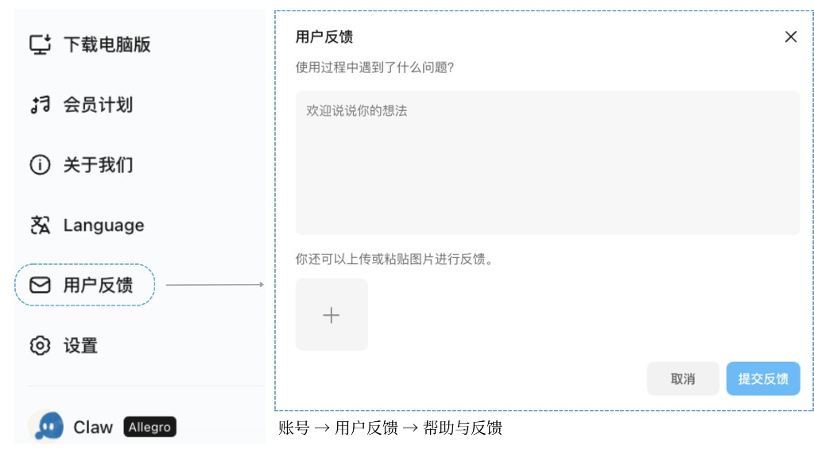
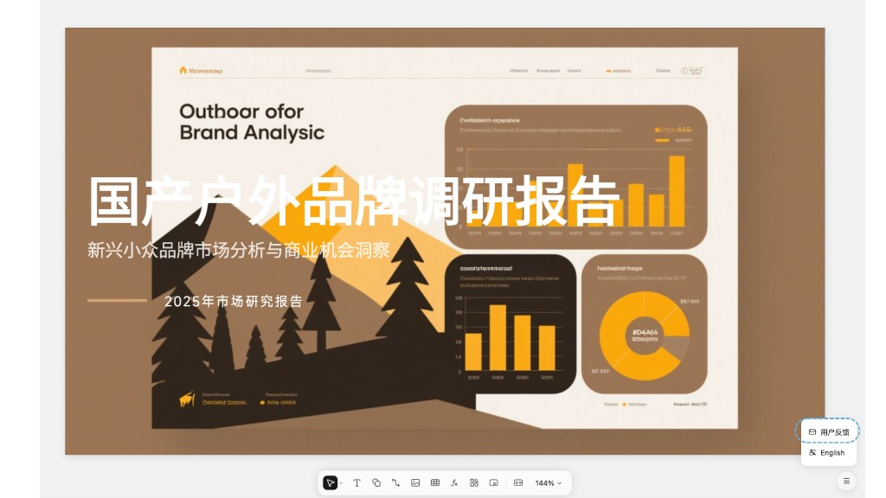

<SeoMeta
  title="PPT 找不到或打不开怎么办？常见问题排查 - Kimi 帮助中心"
  description="PPT 功能入口找不到、文件打不开或下载异常？本文提供全面排查方案，涵盖各端入口指引、浏览器拦截修复和文件损坏处理。"
  pageUrl="https://www.kimi.com/help/ppt/ppt-troubleshooting"
/>
# 找不到 PPT，PPT 打不开

如果你遇到 PPT 功能入口找不到、生成的 PPT 无法打开或下载后文件异常等问题，可参考以下排查步骤。

## 常见问题与排查

### 找不到 PPT 功能入口

1. **网页版**：打开 [kimi.com](https://www.kimi.com/)，在对话输入框下方点击「PPT」快捷入口，或直接访问 [PPT 助手](https://www.kimi.com/slides)
2. **App 端**：打开 Kimi App，点击输入框下方工具栏中的「PPT」按钮
3. **Agent 模式**：在通用 Agent 模式下直接描述 PPT 需求，Kimi 会自动调用 PPT 生成能力

//
如果工具栏中未显示 PPT 入口，请确认 App 已更新至最新版本。
Callout 提示
//

### PPT 打不开或文件损坏

- **浏览器端**：尝试刷新页面后重新打开；如仍无法打开，清除浏览器缓存后重试
- **下载后打不开**：确认使用 Microsoft PowerPoint、WPS 或 Keynote 等支持 `.pptx` 格式的软件打开；部分旧版本办公软件可能不兼容
- **文件为 0KB 或损坏**：通常为生成过程异常导致，请新建对话重新生成

//
部分旧版办公软件可能不兼容，下载后若无法打开，建议下载最新办公软件。
Callout 提示
//

### Edge 浏览器没有出 PPT 卡片

使用 Edge 浏览器时，PPT 生成完成后可能不会弹出下载卡片或预览窗口。这通常是由 Edge 内置的**自动下载拦截机制**导致的。

**情况一：Edge 自动下载被拦截**

Edge 内置了快速连续自动下载限制机制，当检测到页面在短时间内尝试多次下载时，会自动拦截后续请求。

**解决方法：**

1. 在地址栏输入 `edge://settings/content/automaticDownloads` 并回车
2. 在「自动下载」设置中，将 `kimi.com` 添加到「允许」列表
3. 刷新 Kimi 页面，重新生成 PPT

//
如果你的设备由公司统一管理，管理员可能通过策略（Default automatic downloads setting → BlockAutomaticDownloads）全局禁用了自动下载，请联系 IT 管理员将 `kimi.com` 加入白名单。
Callout 注意
//

**情况二：模型生成异常（Badcase）**

如果已确认浏览器设置无误，但 PPT 卡片仍然不出现，可能是模型生成过程出现异常。请参考下方 [Bug 反馈指引](#bug-反馈指引) 提交反馈。

### 生成 PPT 后无法查看与下载

PPT 生成完成后，如果对话中没有出现 PPT 卡片或无法下载，请按以下步骤排查：

1. **切换浏览器**：使用 Chrome、Safari、Firefox 等其他浏览器打开同一对话，查看是否能正常显示 PPT 卡片
2. **切换设备**：在手机 App 或其他电脑上登录同一账号，查看该对话中是否有 PPT 结果
3. **重新生成**：如果多个浏览器和设备均无法看到 PPT 卡片，新建对话重新输入相同需求生成 PPT

//
如果确认多设备、多浏览器均无法查看，请发送邮件至 [support@moonshot.cn](mailto:support@moonshot.cn) 反馈，附上对话链接和问题截图。经核实确认为 Bug 后，我们将为你补偿相应额度。
Callout 提示
//

### PPT 预览空白或样式错乱

- 建议使用 Chrome、Edge、Safari 等主流浏览器的最新版本
- 检查网络连接是否稳定，PPT 预览需要加载在线资源
- 尝试切换浏览器或使用无痕模式排除插件干扰

## Bug 反馈指引

如果以上方法无法解决问题，请通过产品内「👎」反馈通道或发送邮件至 [support@moonshot.cn](mailto:support@moonshot.cn) 提交反馈。为了帮助我们更快定位问题，请尽量提供以下信息：

| 信息类型       | 具体内容                                                   |
|----------------|------------------------------------------------------------|
| **浏览器信息** | 浏览器名称及版本号（如 Chrome 126、Safari 18.1、Edge 126） |
| **系统信息**   | 电脑：操作系统及版本（如 macOS 15.4、Windows 11 24H2）；手机：系统及版本（如 iOS 18.4、Android 15、鸿蒙 5.0）以及手机型号 |
| **问题截图**   | 截取异常页面的完整浏览器窗口或 App 界面                     |
| **操作步骤**   | 简述触发问题的操作流程，方便复现                            |

//
**如何查看浏览器版本：** Chrome 点击右上角「⋮ → 帮助 → 关于 Google Chrome」；Safari 点击菜单栏「Safari 浏览器 → 关于 Safari」；Edge 点击右上角「⋯ → 帮助和反馈 → 关于 Microsoft Edge」。
Callout 提示
//

### 反馈入口

**网页版：** 官网左下角「账号 → 用户反馈 → 帮助与反馈」

//Frames

//

**PPT 结果页面：** 点击 PPT 结果页面右下角「☰」菜单按钮 →「用户反馈」→「PPT 专属反馈入口」，进入 PPT 反馈页面填写反馈信息

//Frames

//
